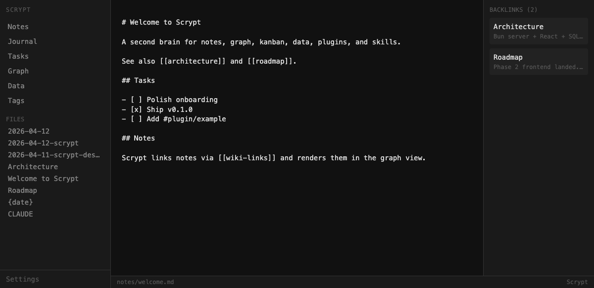
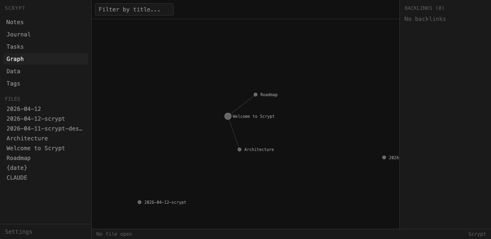
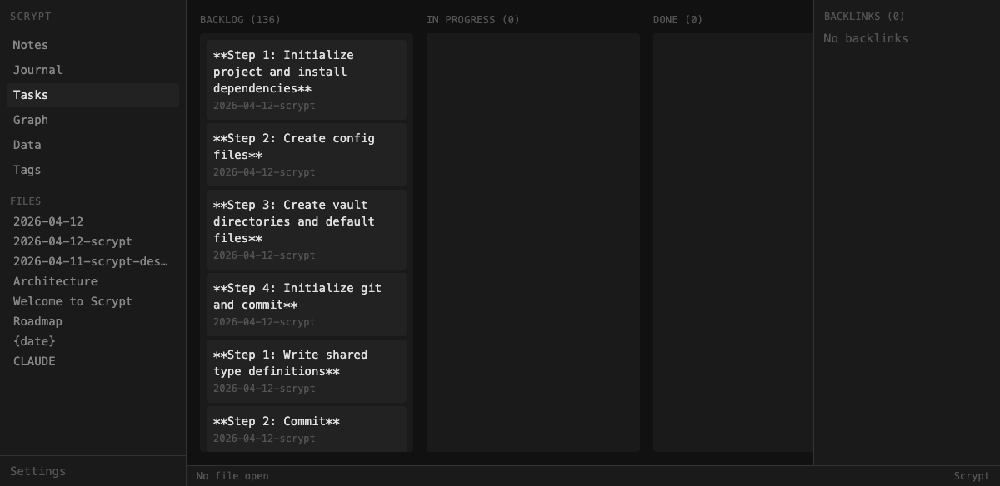
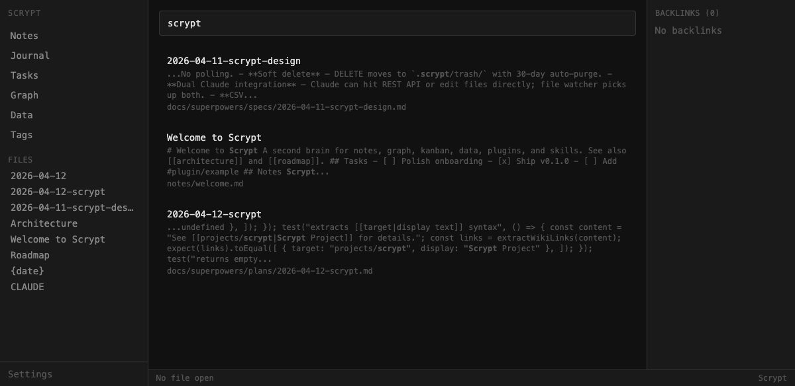
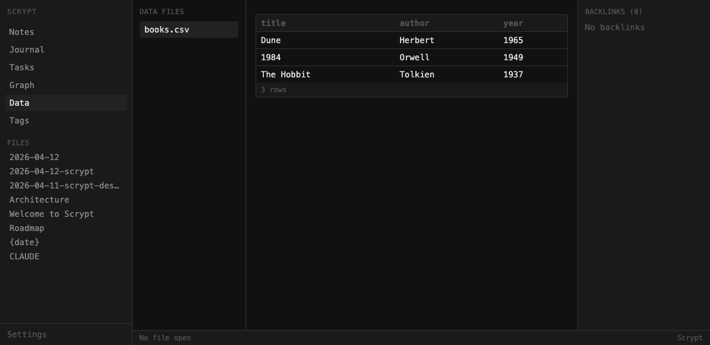

# Scrypt

> A markdown knowledge base with a graph view, full-text search, a kanban board, CSV embeds, and a REST API you can automate against.

Point it at any folder of `.md` files and you get a browser UI for reading, writing, and navigating them — plus an HTTP API for scripts, cron jobs, and Claude to do the same.



## What you get

| | |
|---|---|
| **Editor** | CodeMirror 6 with markdown syntax, auto-save, `Cmd+S`, dark theme |
| **Links** | `[[wiki-links]]`, automatic backlinks panel, clickable navigation |
| **Graph** | D3 force-directed graph of the whole vault — zoom, pan, click to open |
| **Search** | SQLite FTS5 full-text search with BM25 ranking and live results |
| **Kanban** | Every `- [ ]` task across your vault on a drag-and-drop board |
| **Journal** | Daily notes with a date picker and template substitution |
| **Data** | Drop a `.csv` in `data/`, get a sortable table preview |
| **Tags** | `#tag` extraction with a hierarchical browser (`#project/scrypt`) |
| **Templates** | Per-note templates with `{date}`, `{title}`, `{now}` |
| **Command palette** | `Cmd+K` fuzzy search across every note |
| **REST API** | Full read/write surface — notes, search, graph, tasks, data, more |
| **Live reload** | External edits (git pull, another editor) appear in the UI instantly |



## Built with

- **[Bun](https://bun.sh)** — runtime, bundler, test runner, SQLite driver, HTTP server
- **React 19 + Vite + Tailwind** — client
- **CodeMirror 6** — editor
- **D3** — graph rendering
- **SQLite FTS5** — index and search
- **Zustand** — client state
- **`@dnd-kit`** — kanban drag-and-drop

Zero runtime dependencies beyond Bun. No Node, no npm, no database server to install.

## Who it's for

- **You, if you like markdown** and want something more capable than "a folder of files" without locking your data in a cloud app.
- **Developers** who want to drive a knowledge base from scripts — dump research notes from a curl call, query the graph from a cron job, build a custom view on top of the API.
- **Anyone building with Claude or another LLM** who needs a scriptable place to write and read notes. Every endpoint takes JSON in, returns JSON out, and the vault is plain markdown you can still edit by hand.

## Quick start

You need [Bun](https://bun.sh) 1.x and a folder of markdown files.

```bash
git clone https://github.com/psianion/scrypt.git
cd scrypt
bun install
bun run build
```

Then point it at any vault:

```bash
cd ~/my-notes
bun /path/to/scrypt/src/server/index.ts
```

Open <http://localhost:3777>.

Drop a file in, hit save, and it's in the graph:

```markdown
---
title: Welcome
tags: [intro]
---

# Welcome

Link to [[another note]] and it shows up in the backlinks panel
and graph view.

- [ ] Check the kanban view for this task
- [x] Read this README
```

## Using it in the browser

| Route | Shows |
|---|---|
| `/journal` | Today's daily note (auto-created from template) |
| `/notes` | All notes with sort + tag filter |
| `/graph` | Interactive force-directed graph |
| `/tasks` | Kanban board of every inline task |
| `/data` | CSV file browser with sortable preview |
| `/tags` | Hierarchical tag tree |
| `/search` | Live full-text search |
| `/settings` | Editor preferences |
| `/note/*path` | Edit any note |

Shortcuts: `Cmd+K` opens the command palette, `Cmd+S` saves the current note.



## Using it from the API

The browser UI talks to the same REST API your scripts will. JSON in, JSON out.

### Create a note

```bash
curl -X POST http://localhost:3777/api/notes \
  -H "Content-Type: application/json" \
  -d '{
    "path": "notes/inbox/from-cli.md",
    "content": "# Hello from curl",
    "tags": ["automation"]
  }'
```

### Search

```bash
curl "http://localhost:3777/api/search?q=scrypt"
```

### List open tasks

```bash
curl "http://localhost:3777/api/tasks?done=false"
```

### Get the graph as JSON

```bash
curl http://localhost:3777/api/graph | jq .
```

### Full endpoint map

| Method | Path | Purpose |
|---|---|---|
| `GET` | `/api/notes` | List notes with `?tag`, `?folder`, `?sort` filters |
| `GET` | `/api/notes/*path` | Read a note with frontmatter + backlinks |
| `POST` | `/api/notes` | Create a note |
| `PUT` | `/api/notes/*path` | Update a note |
| `DELETE` | `/api/notes/*path` | Soft-delete to `.scrypt/trash/` |
| `GET` | `/api/search?q=` | Full-text search |
| `GET` | `/api/search/tags?q=` | Tag completion |
| `GET` | `/api/graph` | Whole-vault graph |
| `GET` | `/api/graph/*path?depth=N` | Local subgraph |
| `GET` | `/api/backlinks/*path` | Linking notes with context |
| `GET` | `/api/journal/today` | Today's note |
| `GET` | `/api/journal/:date` | Entry for a specific date |
| `GET` | `/api/templates` | List templates |
| `POST` | `/api/templates/apply` | Create a note from a template |
| `GET` | `/api/tasks` | All inline tasks (`?board`, `?done`, `?tag`) |
| `PUT` | `/api/tasks/:id` | Update task state |
| `GET` | `/api/data` | List CSV/XLSX files |
| `GET` | `/api/data/*file` | Parsed CSV as JSON |
| `GET` | `/api/data/*file/schema` | Headers, types, row count |
| `POST` | `/api/files/upload` | Upload an asset |
| `GET` | `/api/files/*path` | Serve an uploaded asset |
| `GET` | `/api/plugins` | List installed plugins |
| `GET` | `/api/skills` | List skill definitions |



## Vault layout

Any `.md` file anywhere under the vault is indexed. Scrypt is opinionated about where things live but doesn't enforce it.

```
my-notes/
├── notes/            Your main notes
│   ├── inbox/        Quick captures, to triage later
│   ├── projects/
│   └── welcome.md
├── journal/          One file per day (YYYY-MM-DD.md)
├── data/             CSV files browsable in the Data view
├── templates/        Markdown templates with {date}, {title}, {now}
├── assets/           Uploaded images and attachments
└── .scrypt/          Scrypt's own state (ignored by git)
    ├── scrypt.db     SQLite index — regenerated if deleted
    └── trash/        Soft-deleted notes
```



## Development

```bash
bun install
bun run dev           # server with hot reload on :3777
bun run dev:client    # Vite on :5173 for the React side
bun run test          # full test suite (server + client)
bun run build         # production client bundle
```

```
src/
├── server/           Bun server — API, indexer, watcher, WebSocket
│   ├── api/          REST route handlers
│   ├── db.ts         SQLite schema and FTS5 setup
│   ├── indexer.ts    Two-pass reindex pipeline
│   ├── file-manager.ts
│   ├── parsers.ts    Frontmatter, wiki-links, tags, tasks
│   ├── router.ts
│   └── websocket.ts  Live-reload broadcaster
├── client/           React + Vite + Tailwind
│   ├── views/        Routed views
│   ├── components/
│   ├── store.ts      Zustand
│   └── api.ts        Fetch wrapper for the REST API
└── shared/
    └── types.ts      Types used on both sides
```

## Contributing

1. Fork, create a feature branch
2. Write tests first — TDD is the house style, check existing tests for the pattern
3. `bun run test` must pass
4. Open a PR against `main`

## License

MIT
