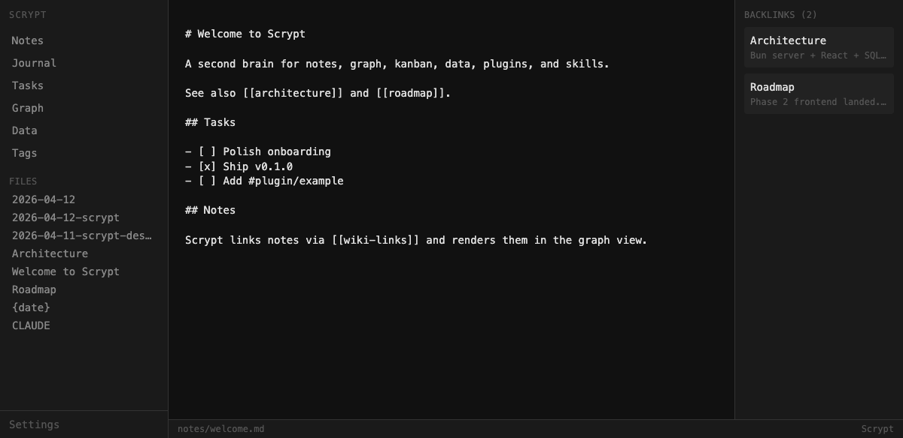
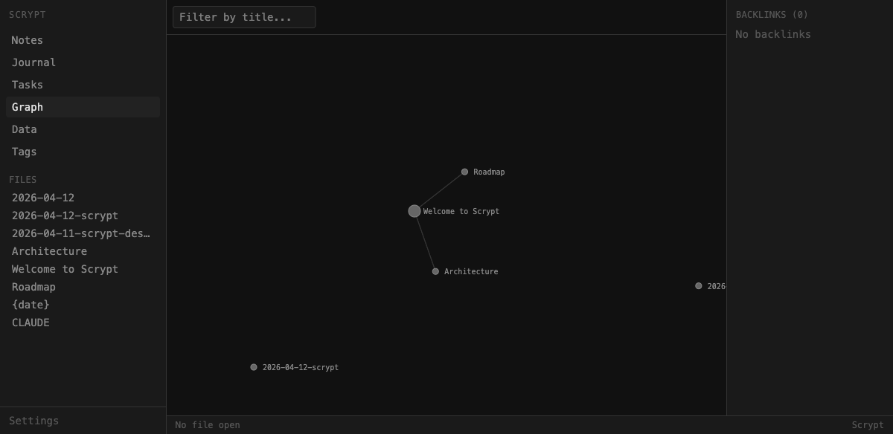

# Scrypt

**A second brain that Claude can actually use.**

Your notes are plain `.md` files on disk. Scrypt indexes them with SQLite, serves them through a browser UI and a REST API, and exposes them to Claude over MCP — so the AI reads and writes into the *same* vault you do. Your knowledge base stops starting from scratch every chat.



Everything lives at `projects/<project>/<doc_type>/<slug>.md`. Ingested notes carry an `ingest:` block (source hash, tokens, cost, model) and an optional `thread:` that chains a workstream together — research → spec → plan — with typed lineage edges (`derives-from`, `implements`, `supersedes`).

## What's inside

| | |
|---|---|
| **Editor** | CodeMirror 6 markdown — auto-save, line wrap, live backlinks |
| **Graph** | WebGL canvas, tiered edges (`connected` / `mentions` / `semantic`) from typed links + embedding similarity |
| **Search** | FTS5 keyword **and** semantic search over local `bge-small-en-v1.5` embeddings, hybrid-ranked |
| **MCP** | 19 tools over stdio + streamable-HTTP — JSON-RPC, bearer auth, idempotent writes |
| **Sync** | Git-style push/pull across devices through a private Tailscale hub, with a 3-way clash resolver |
| **Plus** | Kanban of every `- [ ]` in the vault · CSV/XLSX preview · tag browser · live embedding overlay · opt-in git autocommit · token-driven light/dark UI |



## Get running

One command sets everything up. The `scrypt` CLI detects your runtime, generates a strong token, writes `.env` (merging — never clobbering), starts the server, verifies health, runs a security audit, and wires Claude in.

```bash
git clone https://github.com/psianion/scrypt.git
cd scrypt
bun install
bun run scrypt init
```

That's it. The wizard asks three things — profile, vault, ingest folder — and handles the rest.

> **Windows / PowerShell:** `bun run scrypt <command>` works everywhere. `bun link` also drops a `scrypt` shim on your PATH.

### Pick a profile

| Profile | What it does | |
|---|---|---|
| **native** | Run locally with Bun — fastest for dev | ⚠️ binds all interfaces; don't expose untrusted. Run `scrypt doctor`. |
| **docker** | Run locally in Docker — production-like | Auto-detects x64 / Apple Silicon. Token required. |
| **vps** | Turn this machine into a sync client | Points at a remote hub; no local server. |

Handy flags: `--profile`, `--vault <path>`, `--yes` (no prompts), `--print-env` (dry run), `--rotate-token`.

### Day-to-day

```bash
bun run scrypt up                 # start, wait for /health
bun run scrypt down [--volumes]   # stop (--volumes also clears the embed cache)
bun run scrypt doctor             # health + security audit
bun run scrypt mcp install        # (re)register the MCP server in Claude
bun run scrypt token rotate       # new auth token
bun run scrypt sync status        # push/pull against the hub
```

`scrypt doctor` is your safety net — it catches a missing token on an exposed server, the native all-interfaces bind, a `.env` that slipped out of `.gitignore`, a mismatched compose platform, and more.

## Claude as a power user

`scrypt mcp install` (run for you at the end of `init`) registers Scrypt's tools in Claude Code. It reads the token and port from `.env`, probes the server, and is idempotent.

- **Read** — `get_note`, `search_notes`, `semantic_search`, `find_similar`, `walk_graph`, `cluster_graph`, `get_report`
- **Write** — `create_note`, `update_note_metadata`, `add_section_summary`, `add_edge`, `remove_edge`
- **Tasks** — `create_task`, `get_task`, `list_tasks`, `update_task`, `delete_task`
- **Maintenance** — `batch_ingest`, `rescan_similarity`

Every `create_note` runs the full chunk + embed pipeline server-side and streams progress to the UI. Prefer stdio? `bun run scrypt-mcp`.

## Sync across devices

Scrypt is single-user, but your vault can live on many machines. One VPS instance is the hub; every other machine pushes its new notes and pulls the rest, git-style. Pushes are additive — sync never deletes the other side — and when both ends edited the same note, your local copy wins and the clash is flagged for the in-app 3-way resolver.

It all runs over your [Tailscale](https://tailscale.com) tailnet, so the hub never touches the public internet. Point each client at it:

- `SCRYPT_HUB_URL` — the hub's tailnet URL, e.g. `http://100.x.y.z:3777`
- `SCRYPT_AUTH_TOKEN` — the shared token; remote callers must send it as `Bearer <token>`

The hub is just the standard Docker deploy (`docker-compose.vps.yml`). Full runbook in `docs/CONFIG-vault-sync.md`.

## Configuration

The CLI writes a sensible `.env` for you. The knobs worth knowing:

| Var | Default | |
|---|---|---|
| `SCRYPT_AUTH_TOKEN` | — | Required for any non-localhost caller |
| `SCRYPT_VAULT_PATH` | `cwd` | Where your notes live (`/vault` in Docker) |
| `SCRYPT_PORT` | `3777` | |
| `SCRYPT_HUB_URL` | — | Tailnet URL of the sync hub |
| `SCRYPT_GIT_AUTOCOMMIT` | `0` | `1` snapshots the vault every 15 min |
| `SCRYPT_EMBED_DISABLE` | `0` | `1` skips embeddings entirely |

Embeddings default to `Xenova/bge-small-en-v1.5` and need no tuning. Full catalog and the `.env → docker-compose → loadConfig` flow live in `docs/BUILD_AND_RUN.md`.

## Docs

`docs/` is gitignored (your local copy):

- `docs/BUILD_AND_RUN.md` — every run mode, env walkthrough, troubleshooting
- `docs/ARCHITECTURE.md` — data model, indexer pipeline, MCP + embeddings internals
- `docs/API.md` — every REST endpoint and MCP tool

## License

MIT
