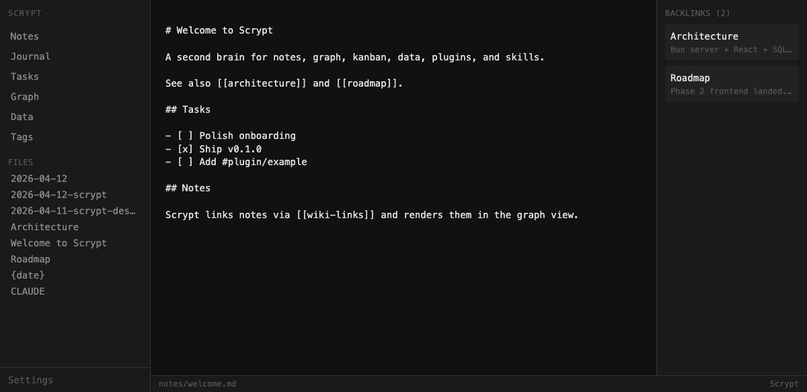
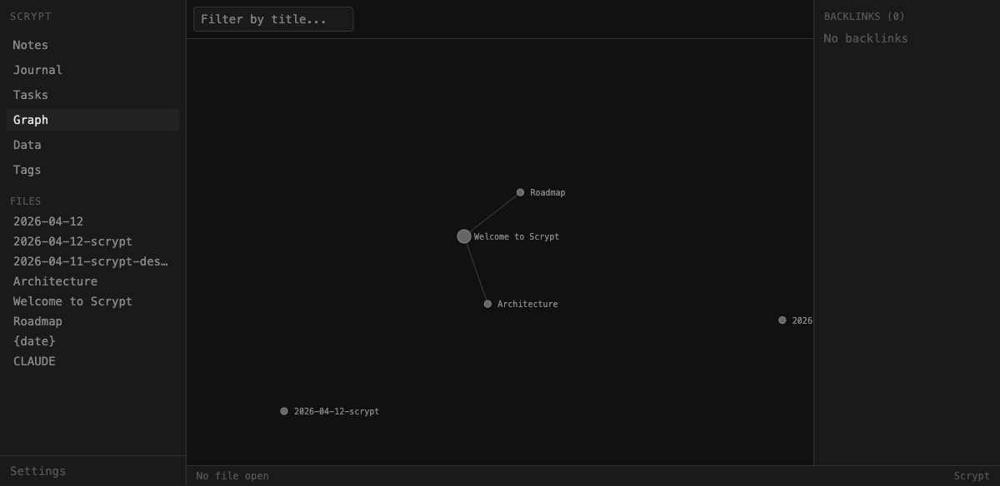

# Scrypt

**A second brain that Claude can actually use.**

Your notes are plain `.md` files on disk. Scrypt indexes them with SQLite, serves them through a browser UI and a REST API, and exposes them to Claude over MCP — so the AI reads and writes into the *same* vault you do. Your knowledge base stops starting from scratch every chat.



Everything lives at `projects/<project>/<doc_type>/<slug>.md`. Ingested notes carry an `ingest:` block (source hash, tokens, cost, model) and an optional `thread:` that chains a workstream together — research → spec → plan — with typed lineage edges (`derives-from`, `implements`, `supersedes`).

## What's inside

| | |
|---|---|
| **Editor** | CodeMirror 6 markdown — auto-save, line wrap, live backlinks |
| **Graph** | WebGL canvas, tiered edges (`connected` / `mentions` / `semantic`) from typed links + embedding similarity |
| **Search** | FTS5 keyword **and** semantic search over local `bge-small-en-v1.5` embeddings, hybrid-ranked |
| **MCP** | 20 tools over stdio + streamable-HTTP — JSON-RPC, bearer auth, idempotent writes |
| **Sync** | Git-style push/pull across devices through a private Tailscale hub, with a 3-way clash resolver |
| **Plus** | Kanban of every `- [ ]` in the vault · CSV/XLSX preview · tag browser · live embedding overlay · opt-in git autocommit · token-driven light/dark UI |



## Get running

One command. It installs Bun if you don't have it, clones the repo, builds the web UI, runs the setup wizard, and registers a user service so the server comes back after a reboot.

```bash
# macOS / Linux / WSL
curl -fsSL https://raw.githubusercontent.com/psianion/scrypt/main/install.sh | bash
```

```powershell
# Windows
irm https://raw.githubusercontent.com/psianion/scrypt/main/install.ps1 | iex
```

Then open http://localhost:3777. Your notes live in `~/scrypt-vault` unless you set `SCRYPT_VAULT` before running the installer. To join an existing sync hub, set `SCRYPT_HUB_URL` and `SCRYPT_AUTH_TOKEN` (the hub's token) first; see [Sync across devices](#sync-across-devices).

Prefer to do it by hand, or already have Bun?

```bash
git clone https://github.com/psianion/scrypt.git && cd scrypt
bun install && bun run build
bun run scrypt init          # wizard: profile, vault, sync hub; builds nothing you already built
bun run scrypt service install   # optional: systemd --user / launchd / Scheduled Task
```

> `bun run scrypt <command>` works everywhere; `bun link` also puts a `scrypt` command on your PATH.

### Install options

Set any of these before running the installer. Each is one decision:

| Var | Default | What it decides |
|---|---|---|
| `SCRYPT_DIR` | `~/scrypt` | Where the repo is cloned |
| `SCRYPT_VAULT` | `~/scrypt-vault` | The folder your notes live in (created empty) |
| `SCRYPT_HUB_URL` | — | Join a sync hub at this URL; leave unset if this machine is the hub or standalone |
| `SCRYPT_AUTH_TOKEN` | generated | When joining a hub, the hub's token; otherwise a strong one is made for you |
| `SCRYPT_NO_SERVICE` | `0` | `1` skips the always-on service (then start with `scrypt up`) |

Profiles the wizard offers: **native** (Bun on this machine, the default and what the installer uses), **docker** (Compose, port published on loopback only), **vps** (sync client only, no server — a native client with a hub URL is usually what you want instead).

### Commands

Run from the repo as `bun run scrypt <command>`, or `scrypt <command>` once `bun link` has put it on your PATH.

| Command | What it does |
|---|---|
| `init [--profile p] [--vault d] [--hub url] [--yes]` | Setup wizard: writes `.env`, generates the token, builds the UI if needed, starts the server, offers MCP registration |
| `up` / `down [--volumes]` | Start the server and wait for health / stop it (`--volumes` also clears the embedding cache) |
| `service install \| status \| uninstall` | Keep the server running across reboots (systemd --user, launchd, or a Scheduled Task) |
| `doctor [--json]` | Health plus security audit: exposed bind, missing token, `.env` not ignored, stale compose pin |
| `mcp install [--transport stdio]` | Register the MCP server in Claude Code (HTTP by default, or the stdio bridge) |
| `mcp config [--transport stdio]` | Print the `mcpServers` snippet for any other MCP client |
| `mcp uninstall` | Remove the Claude Code registration |
| `sync status \| push \| pull` | Compare with, push to, or pull from the hub |
| `token rotate` | Generate a new auth token (re-run `mcp install` afterwards) |
| `reindex` | Rebuild embeddings for the whole vault |
| `maintenance` | Prune trash, VACUUM, rebuild the full-text index |

## MCP: Claude as a power user

**Register it.** `scrypt mcp install` (offered at the end of `init`) registers Scrypt in Claude Code over HTTP: it reads the token and port from `.env`, probes the server, and is idempotent. `scrypt mcp install --transport stdio` registers the stdio bridge instead, which Claude Code starts per session and which needs no running server. Any other MCP client: `scrypt mcp config [--transport stdio]` prints the `mcpServers` snippet to paste.

**Config, one line each.** HTTP: `url` is `http://localhost:<SCRYPT_PORT>/mcp` and the `Authorization: Bearer <SCRYPT_AUTH_TOKEN>` header is required off-loopback. stdio: `bun run <repo>/scripts/scrypt-mcp.ts` with `SCRYPT_VAULT_PATH=<vault>` in its env; it opens `<vault>/.scrypt/scrypt.db` directly and shares it safely with a running server. The vault's `SCHEMA.md` is sent as the server's instructions, so edit it to change how the agent files notes.

**Tools.** Every tool carries MCP annotations, so clients auto-allow the read-only ones and confirm the two destructive ones.

| Tool | What it does |
|---|---|
| `get_note` | Read a note by vault path: content, frontmatter, sections, metadata, edges |
| `search_notes` | Keyword search (FTS5) with project, doc_type and thread filters |
| `semantic_search` | Embedding search: notes whose chunks are closest to the query |
| `find_similar` | Notes similar to a given note, from its stored vectors |
| `walk_graph` | Breadth-first walk from a node, filtered by edge tier, capped at 500 nodes |
| `cluster_graph` | Louvain community detection; writes each node's community id |
| `get_report` | Markdown summary of the graph with per-project and per-thread rollups |
| `create_note` | Create or replace a note; parses, chunks and embeds it server-side |
| `update_note_metadata` | Set description, entities, themes, doc_type, summary on a note |
| `add_section_summary` | One-line summary on a note section |
| `add_edge` / `remove_edge` | Add a typed edge between notes or sections / remove user-added edges (indexer edges are never touched) |
| `create_task` / `get_task` / `list_tasks` / `update_task` / `delete_task` | Tasks of type BRAINSTORM, PLAN, BUILD, RESEARCH, REVIEW or CUSTOM, optionally tied to a note |
| `batch_ingest` | Bulk-ingest `.md` files into `projects/<project>/<doc_type>/<slug>.md` with provenance frontmatter |
| `rescan_similarity` | Rank note pairs above a cosine threshold as edge candidates; writes nothing |
| `lint_vault` | Read-only sweep: orphans, broken links, entities without a page, superseded notes still cited, stale inbox |

## Sync across devices

Scrypt is single-user, but your vault can live on many machines. One VPS instance is the hub; every other machine pushes its new notes and pulls the rest, git-style. Pushes are additive — sync never deletes the other side — and when both ends edited the same note, your local copy wins and the clash is flagged for the in-app 3-way resolver.

It all runs over your [Tailscale](https://tailscale.com) tailnet, so the hub never touches the public internet. The hub is just a scrypt instance with no hub URL of its own. Every other machine runs a full scrypt too, with its own UI, and points at the hub:

- `SCRYPT_HUB_URL` — the hub's tailnet URL, e.g. `http://100.x.y.z:3777`
- `SCRYPT_AUTH_TOKEN` — the shared token; remote callers must send it as `Bearer <token>`

The installer takes both as env vars, and `scrypt init` asks for the hub URL. Start a new client from an empty vault and pull first: a note present on both sides with no sync history counts as a clash.

The hub is just the standard Docker deploy (`docker-compose.vps.yml`). Full runbook in `docs/CONFIG-vault-sync.md`.

## Configuration

The CLI writes a sensible `.env` for you. The knobs worth knowing:

| Var | Default | |
|---|---|---|
| `SCRYPT_AUTH_TOKEN` | — | Required for any non-localhost caller; shared by every machine in a sync group |
| `SCRYPT_VAULT_PATH` | `cwd` | Where your notes live (`/vault` in Docker) |
| `SCRYPT_PORT` | `3777` | |
| `SCRYPT_HUB_URL` | — | Tailnet URL of the sync hub; unset on the hub itself |
| `SCRYPT_STATIC_DIR` | repo `dist` | Where the built UI is served from (falls back to `<vault>/dist`) |
| `SCRYPT_GIT_AUTOCOMMIT` | `0` | `1` snapshots the vault every 15 min |
| `SCRYPT_EMBED_DISABLE` | `0` | `1` skips embeddings entirely |
| `SCRYPT_EMBED_MODEL` | `Xenova/bge-small-en-v1.5` | Local embedding model, downloaded once into `<vault>/.scrypt/embed-cache` |

Embeddings default to `Xenova/bge-small-en-v1.5` and need no tuning. Full catalog and the `.env → docker-compose → loadConfig` flow live in `docs/BUILD_AND_RUN.md`.

## Docs

`docs/` is gitignored (your local copy):

- `docs/BUILD_AND_RUN.md` — every run mode, env walkthrough, troubleshooting
- `docs/ARCHITECTURE.md` — data model, indexer pipeline, MCP + embeddings internals
- `docs/API.md` — every REST endpoint and MCP tool

## License

MIT
